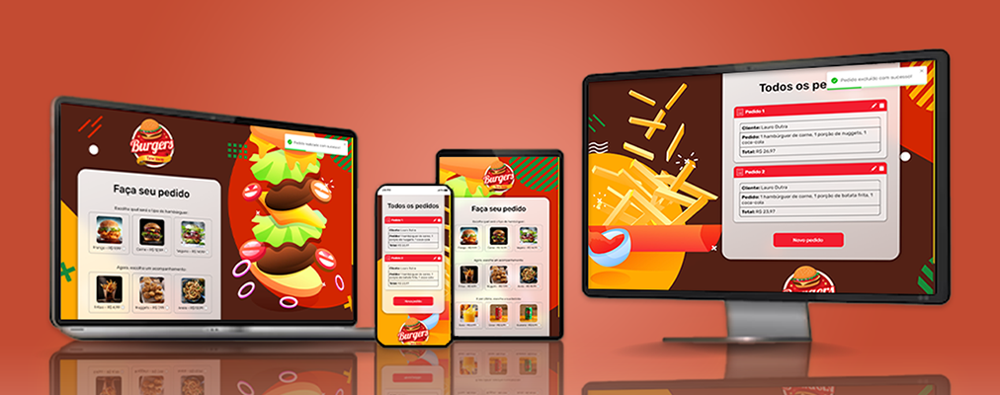

## 📝 Sobre

O projeto <b>Burgers Register</b> apresenta um painel para cadastro de pedido de hambúrqueres, acompanhamentos e bebidas. Após o cadastro, os pedidos são exibidos em uma lista de cards personalizados. O projeto apresenta design responsivo, tendo sido desenvolvido tanto para desktops quanto para dispositivos móveis.

## ⚙ Funcionalidades

Na tela de cadastro, o usuário deve escolher os itens do pedido e preencher seu nome para criar os dados na API e, ao clicar em <i>Fazer pedido</i>, um alerta de sucesso é exibido e o usuário é direcionado para a tela de pedidos. Note que deve ser selecionado pelo menos um item de cada categoria; caso tenha um item faltante e/ou o campo de nome não seja preenchido, um alerta é exibido informando o erro. A segunda tela exibe uma lista de cards personalizados com as informações dos pedidos cadastrados. O botão <i>Excluir</i>, simbolizado pelo ícone de uma lixeira, deleta o usuário da API e o botão <i>Editar</i>, simbolizado pelo ícone de lápis, abre uma tela de edição dentro do card, onde o usuário pode alterar os itens do pedido. O botão <i>Novo pedido</i> retorna à tela de cadastro, onde o usuário pode fazer um novo pedido.

## 🖥 Tecnologias

O projeto foi desenvolvido utilizando Vite como ferramenta de construção rápida para aplicativos web, a biblioteca Axios para requisições HTTP e as bibliotecas Toastify e Confirm Alert para exibição de alertas e mensagens de aviso intuitivas. Com o React.js como biblioteca principal para a criação da interface do usuário, o código foi organizado em componentes reutilizáveis para facilitar a manutenção e escalabilidade do projeto. Além disso, a estilização foi feita utilizando styled-components, permitindo a criação de estilos de forma declarativa e encapsulada, o que ajuda a evitar conflitos e facilita a manutenção do código. A combinação dessas tecnologias proporcionou uma experiência de desenvolvimento ágil e eficiente, resultando em um projeto bem estruturado, modular e esteticamente agradável.